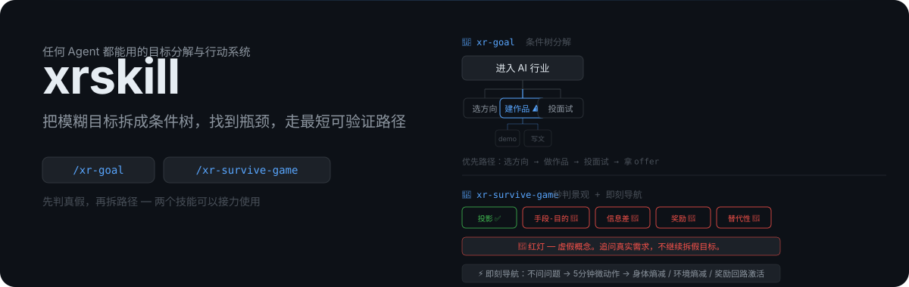
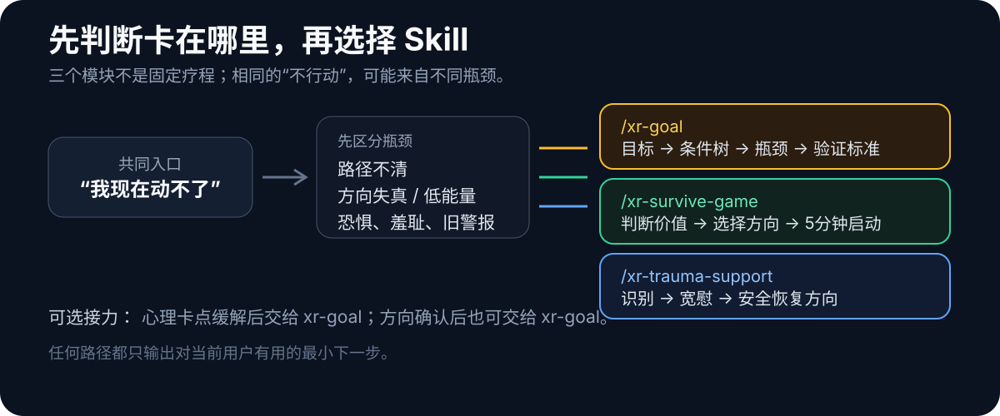

<p align="center">
  
</p>

<p align="center">
  <strong>判断目标，解除卡点，拆出下一步。</strong>
</p>

`xrskill` 是一组面向行动问题的 Agent Skills。它不假设所有“做不到”都缺同一种东西：有时目标太模糊，有时方向本身不值得追，有时人已经知道该做什么，却被恐惧、羞耻、习得性无助或旧经历形成的保护策略卡住。

三个 Skill 可以独立使用，也可以按实际瓶颈接力。

## 技能总览

| Skill | 核心任务 | 明确调用 |
| --- | --- | --- |
| **xr-goal** | 从目标倒推必要条件、当前瓶颈、优先路径和验证标准 | `/xr-goal` |
| **xr-survive-game** | 判断目标是否真实；低能量时给出5分钟微动作 | `/xr-survive-game` |
| **xr-trauma-support** | 识别心理卡点，先承接情绪，再形成安全恢复方向 | `/xr-trauma-support` |

<p align="center">
  
</p>

## xr-goal · 把目标变成条件树

适用于“目标已经确定，但不知道怎样实现”。

```text
最终目标
├─ 必要条件
│  └─ 当前瓶颈
│     └─ 可执行叶子节点
├─ 风险与约束
└─ 验证标准
```

它不追求整齐的模板，而是让树的深度跟着真实瓶颈走。输出包括目标定义、前提假设、条件树、优先路径和完成标准。

```text
/xr-goal 我想在三个月内完成一个可以公开使用的 AI 工具
```

## xr-survive-game · 判断值不值得做

适用于“不知道做什么”“怀疑自己在浪费时间”或能量很低、无法启动。

- **秒判景观**：识别虚假概念、信息差陷阱和手段—目的混淆。
- **即刻导航**：卡住时直接给一个5分钟内能闭环的微动作。
- **本地画像**：经用户同意后记录抽象行为模式，让后续判断更贴合用户。

```text
/xr-survive-game 我每天都在研究个人 IP，但一直没有实际产出，这件事值得继续吗？
```

## xr-trauma-support · 处理行动瘫痪的心理根源

这个 Skill 的目的，是处理一部分行动瘫痪的根本原因：并非用户缺少计划，而是创伤、长期羞耻、恐惧、习得性无助或旧保护策略仍在把行动判断为危险。

它采用三步低压力对话：

```text
创伤识别
→ 看见与宽慰
→ 用户稳定并同意后，形成解决方法
```

它不以“猜中隐藏创伤”为成功，也不急着纠正所谓错误价值观。所有来源解释都必须是可撤回假设，并由用户确认；最后可以接入 `xr-goal`，把恢复方向变成一个低风险、可退出、可观察的下一步。

```text
/xr-trauma-support 我知道应该开始，但每次想到可能失败就会僵住，然后责备自己。
```

## 怎么选择

```text
目标明确，只缺路径       → xr-goal
不知道目标是否值得追     → xr-survive-game
知道该做什么却反复僵住   → xr-trauma-support
心理卡点缓解后需要行动树 → xr-trauma-support → xr-goal
方向不清且能量很低       → xr-survive-game → xr-goal
```

## 安装

需要 Node.js 22.20 或更高版本。为 Codex 全局安装全部 Skills：

```bash
npx skills@latest add xiran1984/xrskill --skill '*' --agent codex --global --yes --copy
```

安装完成后，**重新开启一个 Codex 会话**。输入 `/`，应当能看到：

```text
/xr-goal
/xr-survive-game
/xr-trauma-support
```

某些 Agent 客户端使用 `$skill-name` 作为显式调用语法；在这类客户端中使用 `$xr-goal`、`$xr-survive-game` 或 `$xr-trauma-support`。自然语言触发也仍然有效。

只安装一个 Skill：

```bash
npx skills@latest add xiran1984/xrskill --skill xr-goal --agent codex --global --yes --copy
```

安装前查看仓库能发现哪些 Skills：

```bash
npx skills@latest add xiran1984/xrskill --list
```

## 私人档案

公开仓库不包含作者或任何用户的真实私人画像。每个下载安装的 Agent 都在自己的本地环境创建档案：

- `xr-trauma-support/private/user-patterns.example.md`：公开空白模板。
- `xr-trauma-support/private/user-patterns.md`：用户明确同意后从模板创建，已被 Git 忽略。
- `xr-survive-game/memory/`：首次需要画像时在本地创建，整个目录已被 Git 忽略。

默认不记录创伤细节。即使用户同意，也只保存必要的抽象模式；私人内容不得进入案例库、README、测试或发布包。

## 安全边界

`xr-goal` 和 `xr-survive-game` 是行动辅助工具；`xr-trauma-support` 是创伤初筛、自助支持与现实功能恢复工具。它们都不能替代医疗、心理治疗、法律或其他专业服务。

创伤支持模块尤其遵守：

- 不诊断 PTSD、抑郁症或人格障碍。
- 不进行催眠、记忆恢复、强迫宽恕或自行暴露治疗。
- 不指导停药，也不把一次对话称为治愈。
- 出现自伤、伤人、现实暴力、严重戒断或无法保证安全时，停止分析并连接现实支持。
- 未成年人不进行深度创伤处理，优先连接安全成年人和当地保护资源。

方法边界参考 WHO、VA/DoD、NIMH、CDC 和 UNICEF 的公开指南；索引见 [`evidence-sources.md`](./xr-trauma-support/references/evidence-sources.md)。

## 仓库结构

```text
xrskill/
├─ xr-goal/             # 因果条件树与执行路径
├─ xr-survive-game/     # 意义评估与5分钟行动导航
├─ xr-trauma-support/   # 心理卡点、创伤初筛与自助支持
└─ assets/readme/       # README 视觉资源
```

## License

请在使用或分发前确认仓库中的许可证与第三方资料许可。参考文件只保存原创转述、适用条件与安全边界，不复制受版权保护的完整材料。
